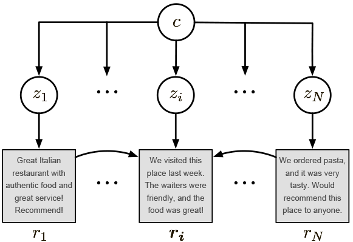

# THVAE

## Introduction

<<<<<<< HEAD
We developed THVAE, an unsupervised timline summarization model based on hierarchical VAE 
=======

The model is fully **unsupervised** and is trained on a large corpus of customer reviews, such as Yelp or Amazon. It generates **abstractive** summaries condensing common opinions across a group of reviews.  It relies on Bayesian auto-encoding that fosters learning rich hierarchical semantic representations of reviews and products. Finally, the model uses a copy mechanism to better preserve details of input reviews.

Example summaries produced by the system are shown below.

* *This restaurant is a hidden gem in Toronto. The food is delicious, and the service is impeccable. Highly recommend for anyone who likes French bistro.*

* *This is a great case for the Acer Aspire 14" laptop. It is a little snug for my laptop, but it's a nice case. I would recommend it to anyone who wants to protect their laptop.*

* *This is the best steamer I have ever owned. It is easy to use and easy to clean. I have used it several times and it works great. I would recommend it to anyone looking for a steamer.*

For more examples, please refer to the [artifacts folder](thvae/artifacts/).
>>>>>>> d3e98a5 (change name)

## Installation

Our code is based on the framework of [Copycat](https://arxiv.org/abs/1911.02247), please follow this [link](https://github.com/abrazinskas/Copycat-abstractive-opinion-summarizer) to build the conda environment.

## Installation
The main model is in [file](https://github.com/Maria-Liakata-NLP-Group/THVAE-summary/blob/main/copycat/modelling/thvae.py), it shows the process of how to use hierarchical VAE to get the latent code of each segment of a timeline.
[file](https://github.com/Maria-Liakata-NLP-Group/THVAE-summary/blob/main/copycat/modelling/interfaces/ithvae.py) has the mehod of how to construct the summary representation using key phrases, the method is 'predict'

## Data

We experimented on talk-lfe datasets 

### Input Data Format

The expected format of input is 

group_id | review_text | category | review_tag
--- | --- | --- | ---
136861_255 | im worthless im literally a fucking failure . let me die | post | im worthless literally failure die

## Key phrases

The method of getting key phrases is in [file: get_prompt.py](https://github.com/Maria-Liakata-NLP-Group/THVAE-summary/blob/main/get_prompt.py), 'read_timeline'.
